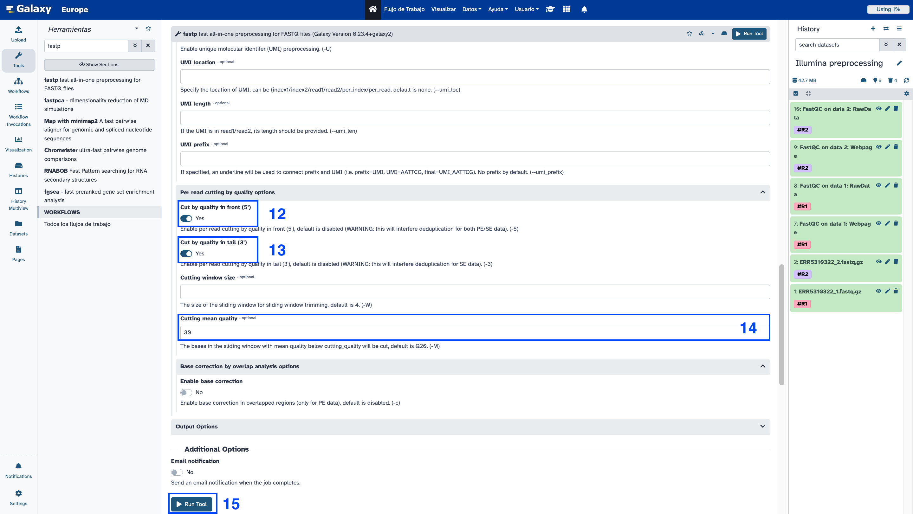
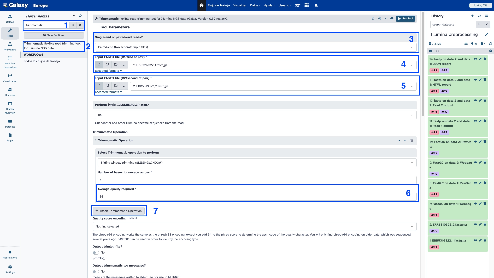
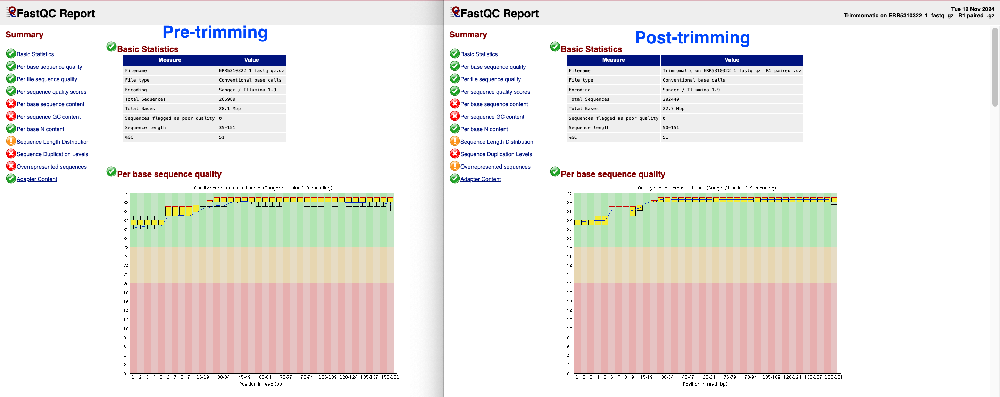

# Galaxy for virologist training Exercise 2: Quality control and trimming

Despite the improvement of sequencing methods, there is no error-free technique. A correct measuring of the sequencing quality is essential for identifying problems in the sequencing, thus, this must be the first step in every sequencing analysis. Once the quality control is finished, it's important to remove those low quality reads, or short reads, for which a trimming step is mandatory. After the trimming step it is recommended to perform a new quality control step to be sure that trimming worked.

# 1. Illumina Quality control and trimming

<div class="tables-start"></div>

|**Title**| Pre-processing |
|---------|-------------------------------------------|
|**Training dataset:**|  PRJEB43037 - In August 2020, an outbreak of West Nile Virus affected 71 people with meningoencephalitis in Andalusia and 6 more cases in Extremadura (south-west of Spain), causing a total of eight deaths. The virus belonged to the lineage 1 and was relatively similar to previous outbreaks occurred in the Mediterranean region. Here, we present a detailed analysis of the outbreak, including an extensive phylogenetic study. This is one of the outbreak samples.
|**Questions:**| <ul><li>How do I check whether my Illumina data was correctly sequenced?</li><li>How can I improve the quality of my data?</li></ul>|
|**Objectives**:|<ul><li>Perform a quality control in raw Illumina reads</li><li>Perform a quality trimming in raw Illumina reads</li><li>Perform a quality control in trimmed Illumina reads</li></ul>|
|**Estimated time**:| 25 min |

<div class="tables-end"></div>

## 1. Quality control

To run the quality control over the samples, follow these steps:
1. [Create a new history, as we explained yesterday](https://github.com/BU-ISCIII/galaxy_virologist_training/blob/one_week_4day_format/exercises/01_introduction_to_galaxy.md#2-galaxys-history) named **Illumina preprocessing**
2. [Upload data as seen yesterday](https://github.com/BU-ISCIII/galaxy_virologist_training/blob/one_week_4day_format/exercises/01_introduction_to_galaxy.md#3-loading-data), copy and paste the following URLs:
```
ftp://ftp.sra.ebi.ac.uk/vol1/fastq/ERR531/002/ERR5310322/ERR5310322_1.fastq.gz
ftp://ftp.sra.ebi.ac.uk/vol1/fastq/ERR531/002/ERR5310322/ERR5310322_2.fastq.gz
```
3. Search for the **fastqc** tool and select **FastQC Read Quality reports** and set the following parameters:
    - Select multiple file data set in Raw read data from your current history
    - With the *Ctrl* key pressed, select the two datasets
    - Then go down and select **Execute**

<p align="center"></p>

To see the results we are going to open the jobs with **Web page** in their name for both data 1 and data 2.

<p align="center"></p>

Here, you can see the number of reads in each file, the maximum and minimum length of all reads in the sample, and the quality plots for both R1 and R2. They look quite good, but we are going to run trimming over the samples.

<details>
<summary>How many reads do the samples have?</summary>
<br>
265989
</details>

**First question**
<details>
<summary>How do I check whether my Illumina data was correctly sequenced?</summary>
<br>
Using FastQC
</details>

## 2. Trimming

Once we have performed the quality control, we have to perform the quality and read length trimming:

1. Search for **fastp** in the tools and select **fastp - fast all-in-one preprocessing for FASTQ files**
2. Select custom parameters:
    - Single-end or paired reads > Paired
        - Input 1 > Browse datasets (right folder icon) > Select ERR5310322_1.fastq.gz
        - Input 2 > Browse datasets > Select ERR5310322_2.fastq.gz
    - Display Filter Options
        - Quality Filtering options
            - Qualified Quality Phred = 30
            - Unqualified percent limit = 10
        - Length Filtering Options
            - Length required = 50
    - Read modification options
        - PoliX tail trimming > Enable polyX tail trimming
        - Per read cutting by quality options
            - Cut by quality in front (5') > Yes
            - Cut by quality in tail (3') > Yes
            - Cutting mean quality = 30
3. Finally, click on **Execute**

<p align="center"></p>
<p align="center"></p>
<p align="center"></p>
<p align="center"></p>

To see the trimming stats, have a look at the **fastp on data 2 and data 1: HTML report** file. You should see something like that.

<p align="center"></p>

<details>
<summary>How many reads have we lost?</summary>
<br>
98664 reads
</details>

### Other trimming tools
1. Search for **trimmomatic** in the tools and select **Trimmomatic flexible read trimming tool for Illumina NGS data**
2. Select custom parameters:
    - Single-end or paired-end reads? = Paired-end (two separated files)
    - Input FASTQ file (R1/first of pair) = ERR5310322_1.fastq.gz
    - Input FASTQ file (R2/second of pair) = ERR5310322_2.fastq.gz
    - Insert Trimmomatic Operation:
        - Select Trimmomatic operation to perform: **MINLEN**
        - Minimum length of reads to be kept = 50
3. Select **Execute**

<p align="center"></p>
<p align="center"></p>

Trimmomatic does not perform statistics over trimmed reads, so we need to perform FastQC again over the Trimmomatic results.

<details>
<summary>Try to do it on your own.</summary>
<br>
<p align="center"></p>
<p align="center"></p>
</details>

**Second question**
<details>
<summary>How can I improve the quality of my data?</summary>
<br>
Using a trimming software, such as fastp or trimmomatic.
</details>

- This hands-on history URL: https://usegalaxy.eu/u/s.varona/h/illumina-preprocessing


# 2. Nanopore Quality control and trimming

<div class="tables-start"></div>

|**Title**| Galaxy |
|---------|-------------------------------------------|
|**Training dataset:**|  The data we are going to manage corresponds to Nanopore amplicon sequencing data using ARTIC network primers por SARS-CoV-2 genome. From the Fast5 files generated by the ONT software, we are going to select the pass reads, so they are already filtered by quality.
|**Questions:**| <ul><li>How do I know if my Nanopore data was correctly sequenced?</li></ul>|
|**Objectives**:|<ul><li>Perform a quality control in raw Illumina reads</li><li>Perform a quality trimming in raw Nanopore reads</li><li>Perform a quality control in trimmed Nanopore reads</li></ul>|
|**Estimated time**:| 15 min |

<div class="tables-end"></div>

## 1. Quality control

### 1.1. PycoQC

To use PycoQC we need to use the `sequencing_summary.txt` provided by de Nanopore sequencing machine.

1. [Upload data as seen yesterday](https://github.com/BU-ISCIII/galaxy_virologist_training/blob/one_week_4day_format/exercises/01_introduction_to_galaxy.md#3-loading-data), copy and paste the following URL:
```
https://raw.githubusercontent.com/nf-core/test-datasets/viralrecon/nanopore/minion/sequencing_summary.txt
```
2. Search for the **Pycoqc** tool and select it.
4. Run the tool as follows:
    - In *A sequencing_summary file*: Select the `sequencing_summary.txt` we just uploaded
    - Leave the rest as defaults
    - Select **Execute**

<p align="center"></p>

Then inspect the resulting PycoQC HTML Report:

<p align="center"></p>

**Question**
<details>
<summary>How many reads do the samples have?</summary>
<br>
3K reads
</details>

<details>
<summary>Do you understand all the plots?</summary>
<br>
<b>Basecalled reads length</b>
<p align="center"></p>
This plot shows the distribution of fragment sizes in the file that was analyzed. Long reads have a variable length and this will show the relative amounts of each different size of sequence fragment. In this example, the distribution of read length is quite dispersed with a minimum read length for the passed reads around 150 and a maximum length ~5000bp. However, most of the reads are about 500 nt length, as expected by the amplicon experiment.
<br>
<br>
<b>Basecalled reads PHRED quality:</b>
<p align="center"></p>
This plot shows the distribution of the Qscores (Q) for each read. This score aims to give a global quality score for each read. The exact definition of Qscores is: the average per-base error probability, expressed on the log (Phred) scale. In case of Nanopore data, the distribution is generally centered around 10 or 12. For old runs, the distribution can be lower, as basecalling models are less precise than recent models. In our case, the median read Qscore is 13, which means that this run has good quality.
<br>
<br>
<b>Basecalled reads length vs reads PHRED quality:</b>
<p align="center"></p>
This representation give a 2D visualisation of read Qscore according to the length.
<br>
<br>
<b>Output over experiment time:</b>
<p align="center"></p>
This representation gives information about sequenced reads over the time for a single run. We can see that the production of reads is decreasing over time, which can be due to the sequencing of mosth of the genetic material, the saturation of pores and/or the degradation of the marial and/or pores. In this example, the “Cummulative” plot area (light blue) indicates that 50% of all reads and almost 50% of all bases were produced in the first 3h of the 8h experiment. We can see that from 6 to 8h of the experiment, only 200 reads were yield, which means that we could have ended the experiment 2h before.
<br>
<br>
<b>Read length over experiment time:</b>
<p align="center"></p>
The read length over experiment time should be stable. It can slightly increase over the time as short fragments tend to be over-sequenced at the beginning and are less present over the time. In this case, as almost all the fragments have same length, the plot is really constant over time.
<br>
<br>
 <b>Read quality over experiment time:</b>
<p align="center"></p>
The read quality over experiment time should be stable too, but usually it slightly decrease over the time as pores get saturated or degraded. In this case, we can see a clear decrease of sequencing quality over experiment time, but it mantains between the good quality values and this can be fixed with further post processing of the reads.
<br>
<br>

<b>Number of reads per barcode</b>:
<p align="center"></p>
This plot shows the number of reads per barcode, which means de number of reads per sample to be demultiplexed. In a goog experiment, all the barcodes should have the same number of reads. In this training we only used reads from barcode01 sample but we can see that barcode08 couldn't be correctly sequenced.
<br>
<br>
<b>Channel activity over time:</b>
<p align="center"></p>
It gives an overview of available pores, pore usage during the experiment, inactive pores and shows if the loading of the flow cell is good (almost all pores are used). In this case, the vast majority of channels/pores are inactive (white) after the 6h of experiment, so the run should have been dinished at that time. You would hope for a plot that it is dark near the X-axis, and with higher Y-values (increasing time) doesn’t get too light/white. Depending if you chose “Reads” or “Bases” on the left the colour indicates either number of bases or reads per time interval.
</details>

<details>
<summary>How do I check whether my Nanopore data was correctly sequenced?</summary>
<br>
Using NanoPlot or PycoQC and having a look to the statistic values.
</details>

## 2. Trimming
When Nanopore reads are being sequenced, the MinKnown software splits Fast5 reads into quality pass and quality fail. As we will select only Fast5 pass reads, we won't need to perform a quality trimming, so even if we see that the reads have a bad Phred score, we know that the ONT software considered the reads as "good quality".

Then we will only be performing a read length trimming. As we are using amplicon sequencing data, we won't be expecting reads smaller than 400 nucleotides, nor higher than 600, which would obviously correspond to chimeric reads.

1. Search for **artic** tool
2. Select **ARTIC guppyplex Filter Nanopore reads by read length and (optionally) quality**
3. While pressing the *Ctrl* key, select the three samples
4. Remove reads longer than = 600
5. Remove reads shorter than = 300
6. Do not filter on quality score (speeds up processing) = Yes (we had already select pass reads)

<p align="center"></p>

Now we are going to repeat NanoPlot on filtered data:

1. Search for the **Nanoplot** tool and select **NanoPlot Plotting suite for Oxford Nanopore sequencing data and alignments**
2. Run the tool as follows:
    - In the *files* part, select ARTIC output file.
    - Display **Options for customizing the plots created**:
        - **Specify the bivariate format of the plots** > _Select all_
        - **Show the N50 mark in the read length histogram** > _Yes_
    - Select **Execute**

<p align="center"></p>
<p align="center"></p>

**Questions**
<details>
<summary>Did our data length and quality improve?</summary>
<br>
Yes, now we hace reads in the length and quality specified.
</details>

<details>
<summary>How many reads did we lost during trimming step?</summary>
<br>
137 reads
</details>

- This hands-on history URL: [https://usegalaxy.eu/u/svarona/h/nanopore-quality](https://usegalaxy.eu/u/s.varona/h/nanopore-quality)

> **_NOTE:_**  We can't use nanofilt because it is not installed in Galaxy
