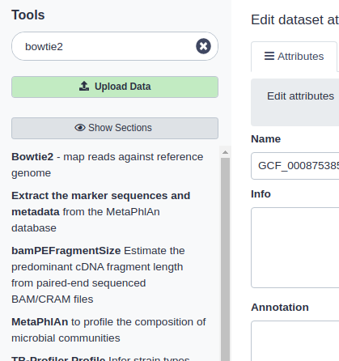
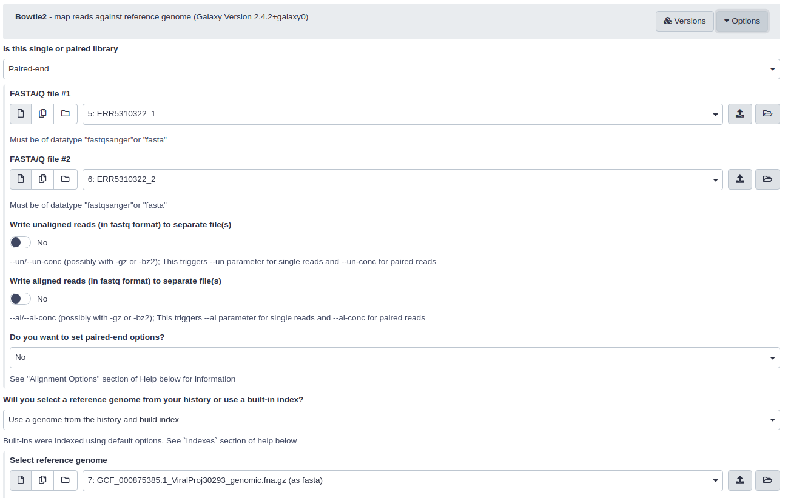
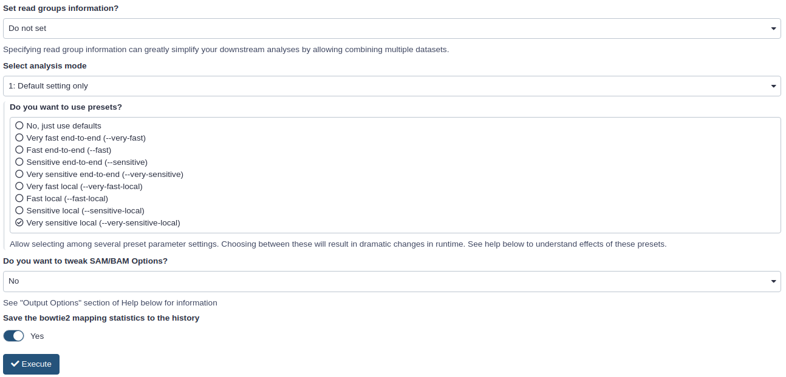
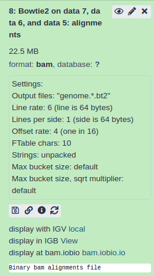

# Galaxy for virologist training Exercise 5: Illumina Mapping 101

<div class="tables-start"></div>

|**Title**| Galaxy |
|---------|-------------------------------------------|
|**Training dataset:**|  PRJEB43037 - In August 2020, an outbreak of West Nile Virus affected 71 people with meningoencephalitis in Andalusia and 6 more cases in Extremadura (south-west of Spain), causing a total of eight deaths. The virus belonged to the lineage 1 and was relatively similar to previous outbreaks occurred in the Mediterranean region. Here we present a detailed analysis of the outbreak, including an extensive phylogenetic study. This is one of the outbreak samples.
|**Questions:**| <ul><li>What is mapping?</li><li>What is a BAM file?</li><li>Which metrics are important to check after mapping?</ul>|
|**Objectives**:|<ul><li>Understand the concept of mapping</li><li>Learn how to interpret mapping metrics</li><li>Learn how to visualize mapping results</li></ul>|
|**Estimated time**:| 40 min |

<div class="tables-end"></div>

## 1. Description
One of the most common experiments using massive sequencing are re-sequencing experiments. This type of experiments sequence already known microorganisms, with the goal to discover variation between an already assembled and known reference, and our reads. Mapping is a mandatory step for this kind of experiments, where we need to sort all the short sequences (reads) we have in our fastq file, lacking any genomic context.
After the mapping step, we will transform our fastq file into a bam file that contains information about where a read came from, meaning we are going to have the coordinates where each read is placed inside our reference genome.

## 2. Upload data to galaxy

### Training dataset
- Experiment info: PRJEB43037, WGS, Illumina MiSeq, paired-end
- Fastq R1: [ERR5310322_1](https://ftp.sra.ebi.ac.uk/vol1/fastq/ERR531/002/ERR5310322/ERR5310322_1.fastq.gz) - url : `ftp://ftp.sra.ebi.ac.uk/vol1/fastq/ERR531/002/ERR5310322/ERR5310322_1.fastq.gz`
- Fastq R2: [ERR5310322_2](https://ftp.sra.ebi.ac.uk/vol1/fastq/ERR531/002/ERR5310322/ERR5310322_2.fastq.gz)  url : `ftp://ftp.sra.ebi.ac.uk/vol1/fastq/ERR531/002/ERR5310322/ERR5310322_2.fastq.gz`
- Reference genome NC_009942.1: [fasta](https://ftp.ncbi.nlm.nih.gov/genomes/all/GCF/000/875/385/GCF_000875385.1_ViralProj30293/GCF_000875385.1_ViralProj30293_genomic.fna.gz) -- [gff](https://ftp.ncbi.nlm.nih.gov/genomes/all/GCF/000/875/385/GCF_000875385.1_ViralProj30293/GCF_000875385.1_ViralProj30293_genomic.gff.gz)

### Create new history
- Click the `+` icon at the top of the history panel and create a new history with the name `mapping 101 tutorial` as explained [here](https://github.com/BU-ISCIII/galaxy_virologist_training/blob/one_week_4day_format/exercises/01_introduction_to_galaxy.md#2-galaxys-history)


### Upload data
- Import and rename the read files `ERR5310322_1` and `ERR5310322_2`
    1. Click in upload data.
    2. Click in paste/fetch data
    3. Copy url for fastq R1 (select and Ctrl+C) and paste (Ctrl+V).
    4. Click in Start.
    5. Wait until the job finishes (green in history)
    6. Do the same for fastq R2.
<p align="center"></p>

- Rename R1 and R2 files.
    1. Click in ✏️ in the history for `ERR5310322_1.fastq.gz`
    2. Change the name to `ERR5310322_1`
    3. Do the same for R2.
    
<p align="center"></p>    

- Import the reference genome and GFF file.

```
https://ftp.ncbi.nlm.nih.gov/genomes/all/GCA/009/858/895/GCA_009858895.3_ASM985889v3/GCA_009858895.3_ASM985889v3_genomic.fna.gz
https://ftp.ncbi.nlm.nih.gov/genomes/all/GCA/009/858/895/GCA_009858895.3_ASM985889v3/GCA_009858895.3_ASM985889v3_genomic.gff.gz
```

<p align="center"></p>

- Rename the reference genome and gff file.
    1. Click the ✏️ for the reference file in the history.
    2. Change the name to `NC_009942.1`

<p align="center"></p>    

### Map reads using Bowtie2
1. Search bowtie2 software in the search tools box on the left.

<p align="center"></p>   

2. Set bowtie2 parameters:
    
    - Is this single or paired library: paired.
    - FASTA/Q file #1 : ERR5310322_1
    - FASTA/Q file #2 : ERR5310322_2
    - Will you select a reference genome from your history or use a built-in index? : Use a genome from the history and build index.
    - Do you want to use presets? : Very sensitive local. This setting will hugly affect the mapping results, depending on the dataset/experiment must be tweaked (read [bowtie2 manual](http://bowtie-bio.sourceforge.net/bowtie2/manual.shtml))
    - Save the bowtie2 mapping statistics to the history

<p align="center"></p>   
<p align="center"></p>   

3. Click execute and wait.

### Visualize bam file and calculate metrics

1. Click the 👁️ icon in the Bowtie2 aligments in history.

<p align="center"></p>

2. Interpret the columns in the bam format according to the theory from class.

3. Visualize mapping metrics
    - Click on the eye icon on Bowtie2 mapping stats history.
    <details>
    <summary> Which is the mapping rate?</summary>
    <br>
    92,61%
    </details>
    
4. Calculate depth of coverage metrics using picard collectWGSMetrics.
    
    - Search collectwgsmetrics on the search tool box.
    - Select SAM/BAM dataset or dataset collection: Bowtie2 alignments
    - Load reference genome from: History and select reference genome fasta file.
    - Treat bases with coverage exceeding this value as if they had coverage at this value: 10000

5. Click execute and wait.


### Visualize bam file using IGV
In order to visualize our mapping we will use IGV (Integrative Genomics Viewer). This is an open source, freely available and lightweight visualization tool that enables intuitive real-time exploration of diverse, large-scale genomic data sets on standard desktop computers. It supports flexible integration of a wide range of genomic data types including aligned sequence reads, mutations, copy number, RNA interference screens, gene expression, methylation and genomic annotations.

Navigation through a data set is similar to that of Google Maps, allowing the user to zoom and pan seamlessly across the genome at any level of detail, from whole genome to base pair. Data sets can be loaded from either local or remote sources, including cloud-based resources, enabling investigators to view their own genomic data sets alongside publicly available data.

1. Install [IGV](https://software.broadinstitute.org/software/igv/download)
2. Launch IGV on your computer
3. Expand the param-file output of Bowtie2 tool
4. Click on the local in display with IGV to load the reads into the IGV browser
5. [Here](https://training.galaxyproject.org/training-material/topics/introduction/tutorials/igv-introduction/tutorial.html) you have a galaxy training document for IGV usage.
