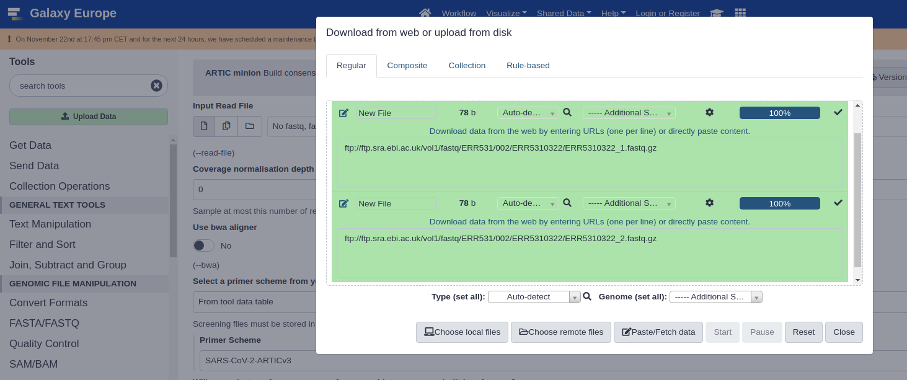
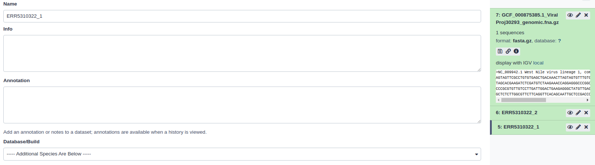
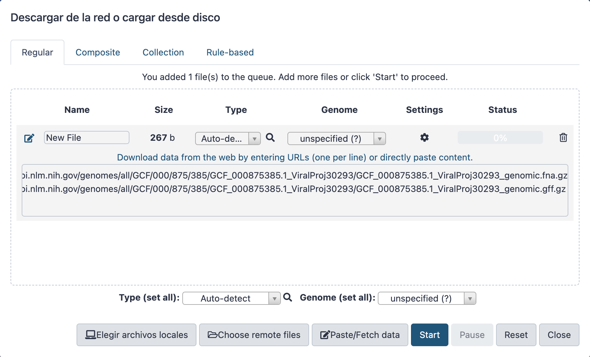
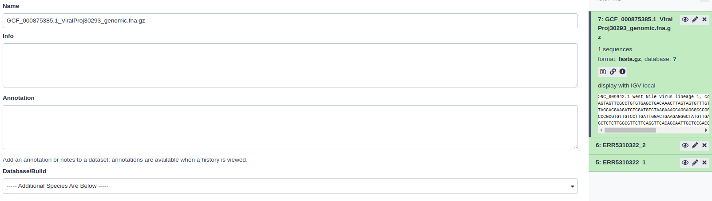
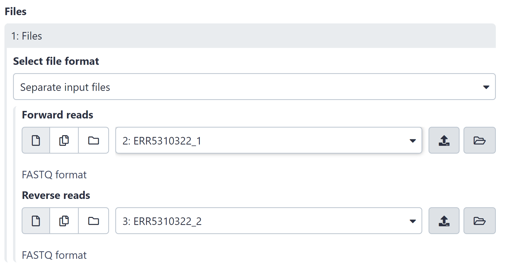
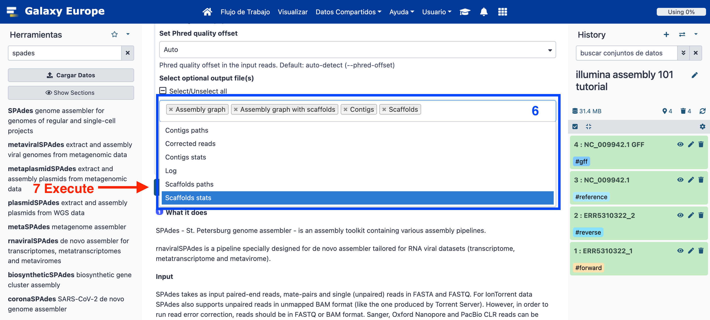
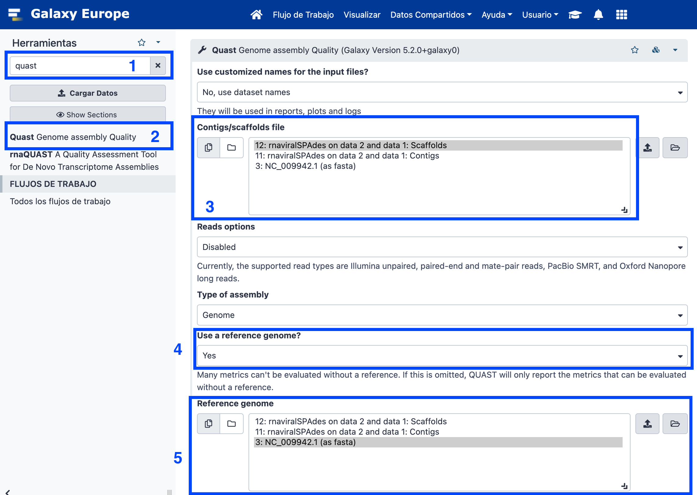
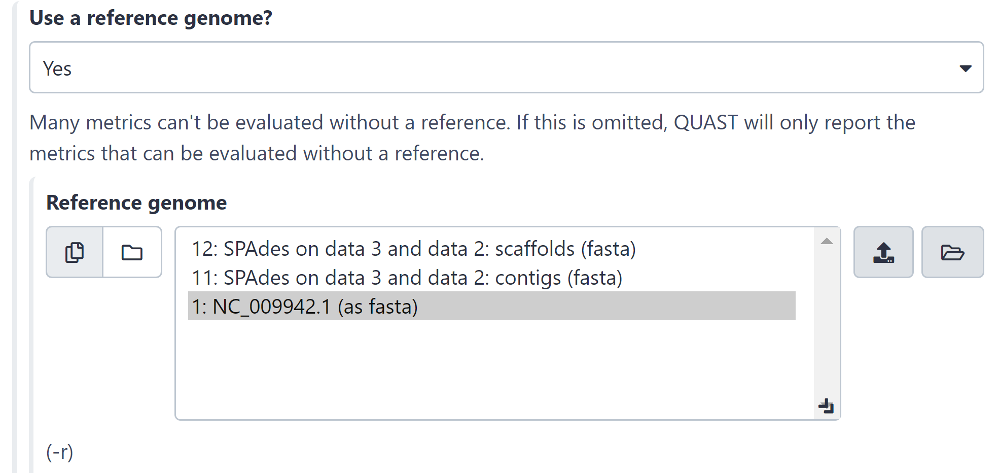
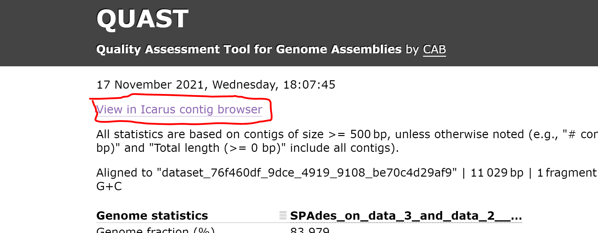

# Galaxy for virologist training Exercise 3: Illumina Assembly 101

|**Title**| Galaxy |
|---------|-------------------------------------------|
|**Training dataset:**|  PRJEB43037 - In August 2020, an outbreak of West Nile Virus affected 71 people with meningoencephalitis in Andalusia and 6 more cases in Extremadura (south-west of Spain), causing a total of eight deaths. The virus belonged to the lineage 1 and was relatively similar to previous outbreaks occurred in the Mediterranean region. Here, we present a detailed analysis of the outbreak, including an extensive phylogenetic study. This is one of the outbreak samples.
|**Questions:**| <ul><li>What is assembly?</li><li>How can I evaluate my assembly?</li></ul>|
|**Objectives**:|<ul><li>Understand assembly concept</li><li>Learn how to interpret assembly quality control metrics</li></ul>|
|**Estimated time**:| 40 min |

## 1. Description
Sometimes, we don't have a reference genome to map against, or we want to reconstruct a genome without any bias caused by a reference. In such cases, we need to do a _de novo assembly_. This type of analysis tries to reconstruct the original genome without any template, using only the reads. 
Some considerations:
- When we assemble, the longer the reads are and the longer the size of the library fragments the easier it gets for the assembler. That's why pacbio or nanopore are recommended for assembly. Think of it like a puzzle, the bigger the pieces, the easier it is to form the image.
- It's almost imposible to reconstruct the entire genome of a large-genome microorganism with only one sequencing, although it can be done for smaller ones, like viruses.
- Assembly is not recommended for amplicon based libraries due to the depth of coverage uneveness and the amplicons intrinsic bias.

## 2. Upload data to galaxy

### Training dataset
- Experiment info: PRJEB43037, WGS, Illumina MiSeq, paired-end
- Fastq R1: [ERR5310322_1](https://ftp.sra.ebi.ac.uk/vol1/fastq/ERR531/002/ERR5310322/ERR5310322_1.fastq.gz) - url : `ftp://ftp.sra.ebi.ac.uk/vol1/fastq/ERR531/002/ERR5310322/ERR5310322_1.fastq.gz`
- Fastq R2: [ERR5310322_2](https://ftp.sra.ebi.ac.uk/vol1/fastq/ERR531/002/ERR5310322/ERR5310322_2.fastq.gz)  url : `ftp://ftp.sra.ebi.ac.uk/vol1/fastq/ERR531/002/ERR5310322/ERR5310322_2.fastq.gz`
- Reference genome NC_009942.1: [fasta](https://ftp.ncbi.nlm.nih.gov/genomes/all/GCF/000/875/385/GCF_000875385.1_ViralProj30293/GCF_000875385.1_ViralProj30293_genomic.fna.gz) -- [gff](https://ftp.ncbi.nlm.nih.gov/genomes/all/GCF/000/875/385/GCF_000875385.1_ViralProj30293/GCF_000875385.1_ViralProj30293_genomic.gff.gz)

### Create new history
- Click the `+` icon at the top of the history panel and create a new history with the name `illumina assembly 101 tutorial` as explained [here](https://github.com/BU-ISCIII/galaxy_virologist_training/blob/one_week_4day_format/exercises/01_introduction_to_galaxy.md#2-galaxys-history)

### Upload data
- Import and rename the read files `ERR5310322_1` and `ERR5310322_2`
    1. Click in upload data.
    2. Click in paste/fetch data
    3. Copy url for fastq R1 (select and Ctrl+C) and paste (Ctrl+V).
    4. Click in Start.
    5. Wait until the job finishes (green in history)
    6. Do the same for fastq R2.

- Rename R1 and R2 files.
    1. Click in the ✏️ in the history for `ERR5310322_1.fastq.gz`
    2. Change the name to `ERR5310322_1`
    3. Do the same for R2.
    

    

- Import the reference genome.
    

- Rename the reference genome.
    1. Click the ✏️ for the reference file in the history.
    2. Change the name to `NC_009942.1`

    

### Assemble reads with Spades

1. Search `Spades` in the search tool box and select _rnaviralSPAdes de novo assembler for transcriptomes, metatranscriptomes and metaviromes_
2. Single-end or paired-end short-reads > Paired-end: individual datasets
3. _FASTQ RNA-seq file(s): forward reads_: ERR5310322_1; _FASTQ RNA-seq file(s): reverse reads_: ERR5310322_2
4. Select optional output file(s) > Scaffolds stats
5. Click execute and wait.

.

> **Warning**

> :coffee::fork_and_knife::clock330: **Assembly takes time!**
> There is no such thing as Assembly in real time. It can take anywhere between 90 minutes and two hours.

.

**Questions:**

Click the :eye: icon in the history: Spades Contigs stats.
    

    
How many contigs has been assembled?

     
    93
    

Click the :eye: icon in the history: Spades scaffolds.

### Assembly quality control with Quast
1. Search Quast in the search tool box.
2. Contigs/Scaffolds file: Spades scaffolds
3. Use a reference genome: Yes. Select the NC_009942.1 fasta file previously loaded.

4. Click the :eye: icon Quast HTML report.
    

    
How much of or reference genome have we reconstructed?

     
    Genome fraction: 83.979%
    

    

    
How many contigs do we have greater than 1000 pb?

     
    5
    

    

    
How long is the largest contig in the assembly?

     
    3029
    

    

    
Which is the N50?

        1836
    

5. Open the Icarus viewer in the quast report.

 
How many contigs align against our reference genome?

  
 6

