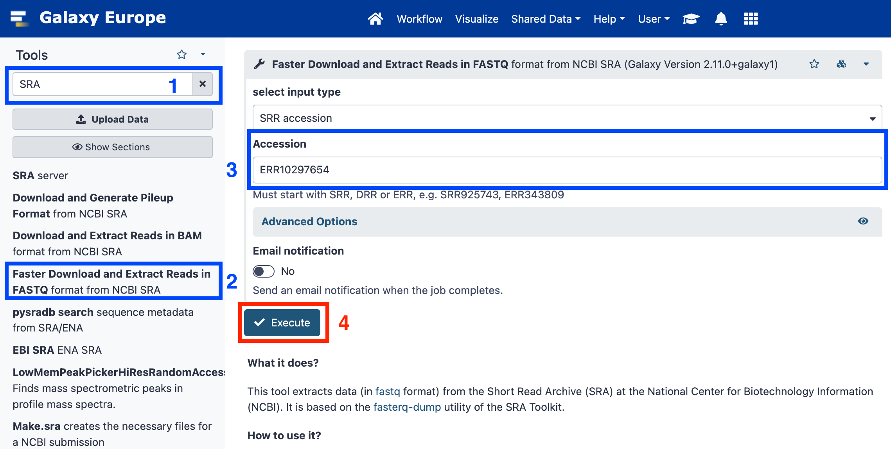
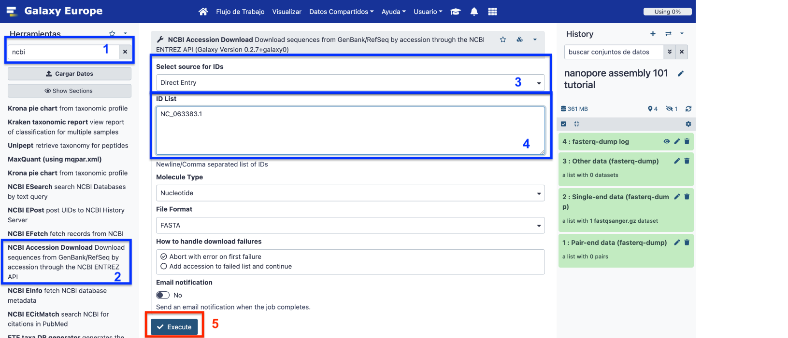
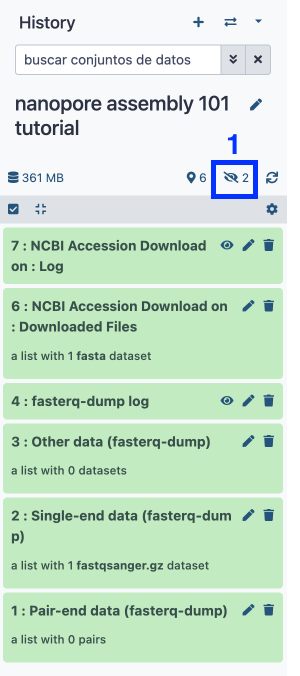
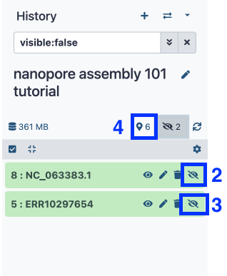
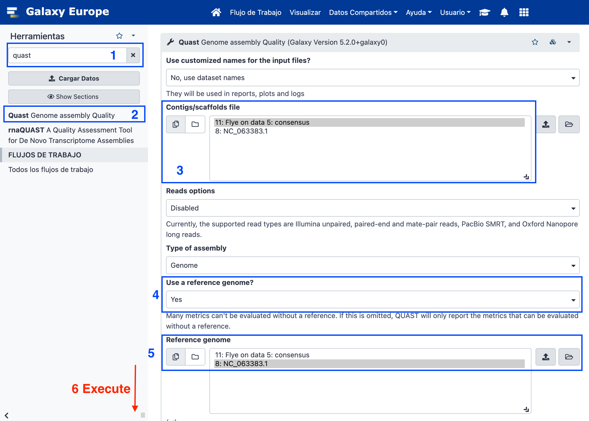
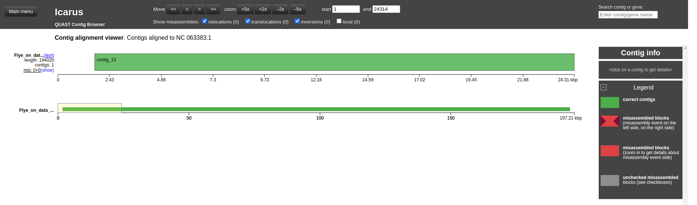

# Galaxy for virologist training Exercise 4: Nanopore Assembly 101

|**Title**| Galaxy |
|---------|-------------------------------------------|
|**Training dataset:**|  Nanopore MinION Sequencing of a Monkey Pox Virus (MPXV) from Spain 2022 oubreak. Data is publicly available at SRA with [ID ERR10297654](https://trace.ncbi.nlm.nih.gov/Traces/?view=run_browser&acc=ERR10297654&display=metadata). [Paper](https://pubmed.ncbi.nlm.nih.gov/38637500/)
|**Questions:**| <ul><li>How Nanopore reads are differently assembled from Illumina?</li></ul>|
|**Objectives**:|<ul><li>Understand the concept of assembly</li><li>Learn how to interpret assembly quality control metrics</li></ul>|
|**Estimated time**:| 40 min |

## 1. Description

Nanopore techology is a third generation sequencing technique which allows to get longer sequences, but with reduced sequence quality. Different technologies have different formats, qualities, and specific known biases which make the analysis different among them. 
In this tutorial, we are going to see an example of how to assemble long reads from a Nanopore sequencing run.

## 2. Upload data to galaxy

### Training dataset

- [SRA ID: ERR10297654](https://trace.ncbi.nlm.nih.gov/Traces/?view=run_browser&acc=ERR10297654&display=metadata

### Create new history

- Click the `+` icon at the top of the history panel and create a new history with the name `nanopore assembly 101 tutorial` as explained [here](https://github.com/BU-ISCIII/galaxy_virologist_training/blob/one_week_4day_format/exercises/01_introduction_to_galaxy.md#2-galaxys-history)

### Upload data

1. Look for `SRA` in the tool search bar and select `Faster Download and Extract Reads in FASTQ format from NCBI SRA`
2. Accession = `ERR10297654`
3. Execute

### Load reference file from NCBI

1. Search `NCBI` using the search toolbox and select `NCBI Accession Download Download sequences from GenBank/RefSeq by accession through the NCBI ENTREZ API`
2. Select source for IDs > Direct entry
3. ID List = NC_063383.1
4. Execute

### Unhide data

Using SRA and NCBI API downloads data as hidden so we are going to unhidde this data as follows:
1. Click on the strikethrough eye (Show hidden)
2. Select the strikethrough for ERR10297654 and NC_063383.1 datas.
3. Then select the location icon (show active)

### Assemble reads with Flye

1. Search `Flye` assembler using the search toolbox and select `Flye de novo assembler for single molecule sequencing reads`
2. Input reads: ERR10297654
3. Click execute and wait.

### Assembly quality control with Quast

1. Search Quast in the search tool box.
2. :warning: **Assembly mode? > Individual assembly**
3. Contigs/scaffolds file > Flye results
4. Use a reference genome: Yes. Select the NC_063383.1 fasta file previously loaded.

4. Click the :eye: icon Quast HTML report.
    

    
How much of or reference genome have we reconstructed?

     
    Genome fraction: 98.25
    

    

    
How many contigs do we have greater than 1000 pb?

     
    12 (this may vary +-1 contig)
    

    

    
How long is the largest contig in the assembly?

     
    194020 (this can vary +-10 nucleotides)
    

    

    
Which is the N50?

    194020 (length of the largest contig in this case)
    

5. Open the Icarus viewer in the quast report.

 
Which contig align against our reference genome?

  
 Contig 13 aligned correctly (this can vary, it should correspond to the number of the largest contig)
 

> This training history is available at: https://usegalaxy.eu/u/s.varona/h/nanopore-assembly-101-tutorial

> Note: Nanopore data is known to have more error than short sequencing reads. This is why assembly post-processing is strongly recommended, usually using combined sequencing aproximation with both Nanopore and Illumina reads.
