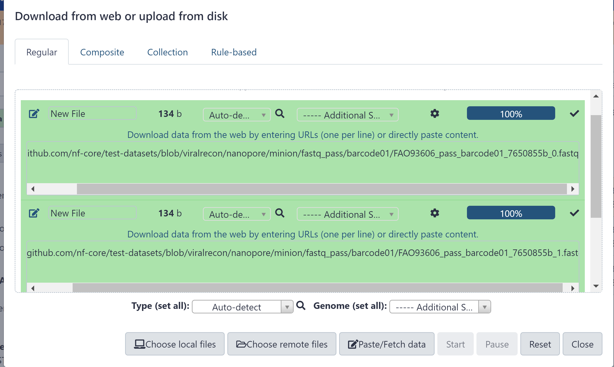
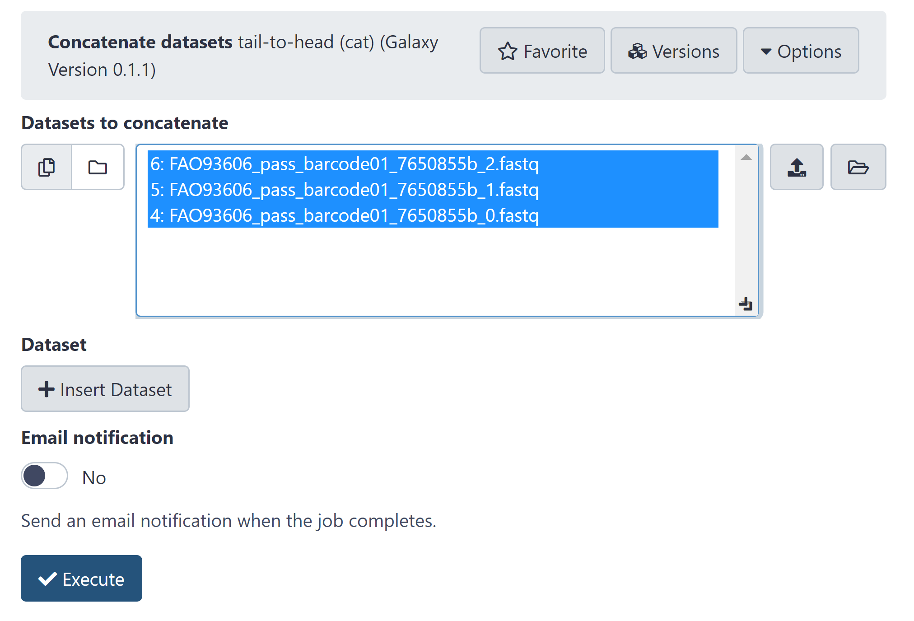
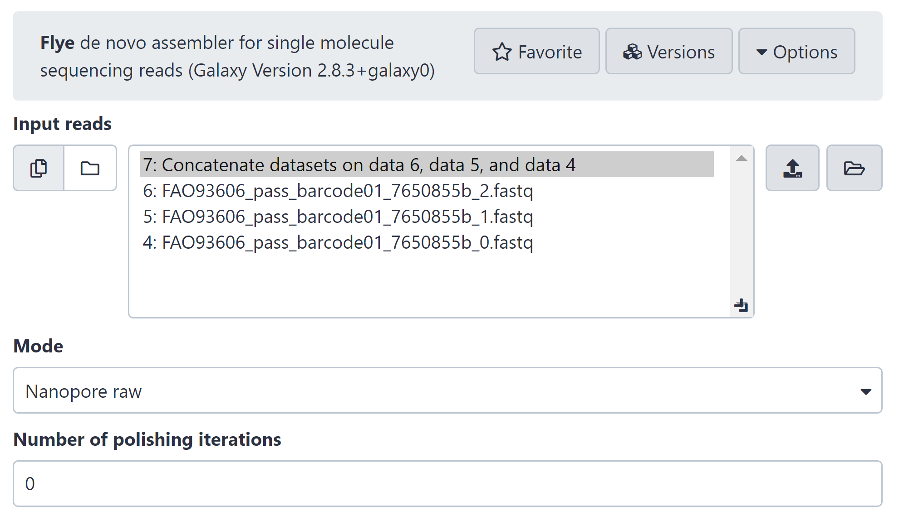
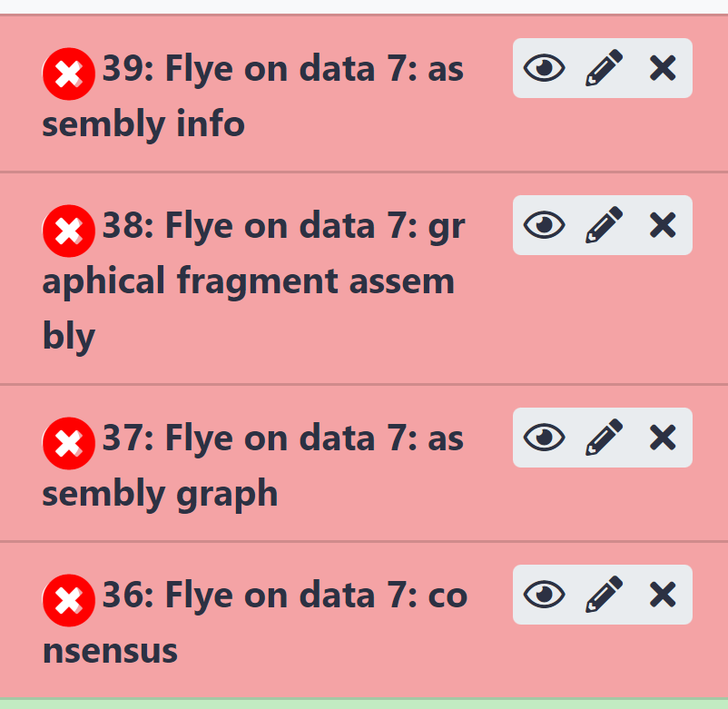
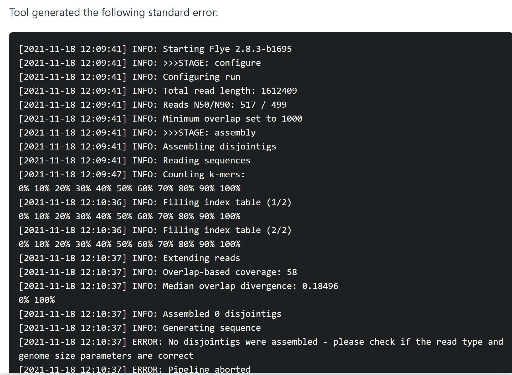

# Galaxy for virologist training Exercise 4: Nanopore mapping and Assembly 101

<div class="tables-start"></div>

|**Title**| Galaxy |
|---------|-------------------------------------------|
|**Training dataset:**|  Nanopore Sequencing of a SARS-Cov-2 
|**Questions:**| <ul><li>How Nanopore reads are differently assembled from Illumina?</li></ul>|
|**Objectives**:|<ul><li>Understand the concept of assembly</li><li>Learn how to interpret assembly quality control metrics</li></ul>|
|**Estimated time**:| 40 min |

<div class="tables-end"></div>

## 1. Description
Nanopore techology is a third generation sequencing technique which allows to get longer sequences, but with reduced sequence quality. Different technologies have different formats, qualities, and specific known biases which make the analysis different among them. 
In this tutorial, we are going to see an example of how to assemble long reads from a Nanopore sequencing run.

## 2. Upload data to galaxy

### Training dataset
- Experiment info: [sequencing summary](https://github.com/nf-core/test-datasets/blob/viralrecon/nanopore/minion/sequencing_summary.txt)
- fastq: 
    - [fastq1](https://raw.githubusercontent.com/nf-core/test-datasets/viralrecon/nanopore/minion/fastq_pass/barcode01/FAO93606_pass_barcode01_7650855b_0.fastq)
    - [fastq2](https://raw.githubusercontent.com/nf-core/test-datasets/viralrecon/nanopore/minion/fastq_pass/barcode01/FAO93606_pass_barcode01_7650855b_1.fastq)
    - [fastq3](https://raw.githubusercontent.com/nf-core/test-datasets/viralrecon/nanopore/minion/fastq_pass/barcode01/FAO93606_pass_barcode01_7650855b_2.fastq)
- Reference genome MN908947.3 : [fasta](https://ftp.ncbi.nlm.nih.gov/genomes/all/GCA/009/858/895/GCA_009858895.3_ASM985889v3/GCA_009858895.3_ASM985889v3_genomic.fna.gz) --- [gff](https://ftp.ncbi.nlm.nih.gov/genomes/all/GCA/009/858/895/GCA_009858895.3_ASM985889v3/GCA_009858895.3_ASM985889v3_genomic.gff.gz)

### Create new history
- Click the `+` icon at the top of the history panel and create a new history with the name `nanopore assembly 101 tutorial` as explained [here](https://github.com/BU-ISCIII/galaxy_virologist_training/blob/one_week_4day_format/exercises/01_introduction_to_galaxy.md#2-galaxys-history)

### Upload data
- Import and rename the read files `fastq1`, `fastq2`and `fastq3`
> Note: Nanopore reads are commonly splitted in several files that we need to concatenate prior further analysis depending on the software we are going to use.

```
https://raw.githubusercontent.com/nf-core/test-datasets/viralrecon/nanopore/minion/fastq_pass/barcode01/FAO93606_pass_barcode01_7650855b_0.fastq
https://raw.githubusercontent.com/nf-core/test-datasets/viralrecon/nanopore/minion/fastq_pass/barcode01/FAO93606_pass_barcode01_7650855b_1.fastq
https://raw.githubusercontent.com/nf-core/test-datasets/viralrecon/nanopore/minion/fastq_pass/barcode01/FAO93606_pass_barcode01_7650855b_2.fastq
```

1. Click in upload data.
2. Click in paste/fetch data
3. Copy url for fastq fies (select and Ctrl+C) and paste (Ctrl+V).
4. Click in Start.
5. Wait until the job finishes (green in history)
6. Do the same for the remaining files.

<p align="center"></p>

- Rename files.
    1. Click in the ✏️ in the history for all the files
    2. Change the name to `fastq_X`

### Concatenate reads.
1. Search `Concatenate datasets` using the search toolbox.
2. Select all three fastq files keeping **Cntrl key** clicked.
3. Click execute and wait.
<p align="center"></p>

### Mapping with Minimap2
1. Search `minimap2` using the search toolbox and select `Map with minimap2 A fast pairwise aligner for genomic and spliced nucleotide sequences` 
2. Will you select a reference genome from your history or use a built-in index?: Use a built-in index
3. Using reference genome > SARS-CoV-2 isolate Wuhan-Hu-1, complete genome (NC_045512)
4. Select fastq dataset: Concatenated fastqs. ⚠️ The tool is not properly configured so you can't select directly the fastq, you need to use the folder icon and force the selection of the concatenated fastq dataset.
5. Click execute and wait.

<p align="center"></p>

### Mapping stats with samtools
1. Search `samtools flagstat` using the search toolbox.
2. Bam file to convert: Minimap2 bam output.
3. Click execute and wait.
4. Click in the 👁️ and see the bam stats.

<details>
    <summary> Which is the mapping rate?</summary>
    </br>
    99.87%
</details>
<details>
    <summary>How many reads do we have in our dataset?</summary>
    3042
    </br>
</details>

### Assemble reads with Flye
1. Search Flye assembler using the search toolbox.
2. Input reads: Concatenate datasets.
3. Click execute and wait.
<p align="center"></p>

> ⚠️As mentioned in the illumina tutorial amplicon-based sequencing is not prepared for de novo assembly. Also this dataset is downsampled for time and performance issues so the depth of coverage is very limited.

4. When the job ends, we see that it finished with an error, we can click in the 🐛 icon and see the error description:
<p align="center"></p>
<p align="center"></p>

5. If we search [the error in google](https://github.com/fenderglass/Flye/issues/128) the flye developer suggests some possible fixes that we've tried and they don't work, but points to uneven depth of coverage as a probable source.
6. In conclusion, we can't do a de novo assembly in Galaxy using this data. 
    
> Note: Nanopore data is known to have more error than short sequencing reads. This is why assembly post-processing is strongly recommended, usually using combined sequencing aproximation with both Nanopore and Illumina reads. 
