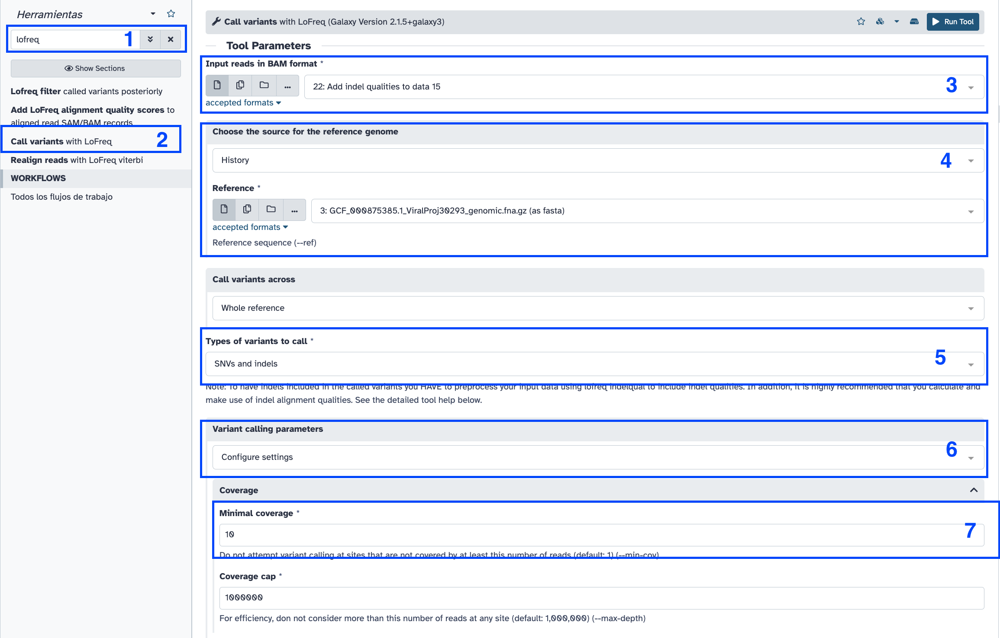

# Galaxy for virologist training Exercise 6: Illumina Variant Calling 101

|**Title**| Galaxy |
|---------|-------------------------------------------|
|**Training dataset:**|  PRJEB43037 - In August 2020, an outbreak of West Nile Virus affected 71 people with meningoencephalitis in Andalusia and 6 more cases in Extremadura (south-west of Spain), causing a total of eight deaths. The virus belonged to the lineage 1 and was relatively similar to previous outbreaks occurred in the Mediterranean region. Here, we present a detailed analysis of the outbreak, including an extensive phylogenetic study. This is one of the outbreak samples.
|**Questions:**| <ul><li>What is variant calling?</li><li>What is a vcf file?</li><li>How can I inspect a variant in a bam file to look for false positives?</li><li>How can I make a consensus genome based on a variant calling process?</li></ul>|
|**Objectives**:|<ul><li>Understand variant calling concept</li><li>Learn how to interpret a vcf file</li><li>Learn how to make a reference consensus genome.</li><li>Learn how to visualize mapping and variant calling results</li></ul>|
|**Estimated time**:| 2h |

## 1. Description
After mapping, when we have a re-sequencing experiment, the next step usually comprises the variants calling step. Variant calling software tries to identify variants, positions that differ in our reads compared to a reference genome.
We may want to have a consensus genome as well, which is obtained by including the variants we just identified in the published reference genome.
We are going to address this type of analysis in this tutorial.

## 2. Upload data to galaxy

### Training dataset
- Experiment info: PRJEB43037, WGS, Illumina MiSeq, paired-end
- Fastq R1: [ERR5310322_1](https://ftp.sra.ebi.ac.uk/vol1/fastq/ERR531/002/ERR5310322/ERR5310322_1.fastq.gz) - url : `ftp://ftp.sra.ebi.ac.uk/vol1/fastq/ERR531/002/ERR5310322/ERR5310322_1.fastq.gz`
- Fastq R2: [ERR5310322_2](https://ftp.sra.ebi.ac.uk/vol1/fastq/ERR531/002/ERR5310322/ERR5310322_2.fastq.gz)  url : `ftp://ftp.sra.ebi.ac.uk/vol1/fastq/ERR531/002/ERR5310322/ERR5310322_2.fastq.gz`
- Reference genome NC_009942.1: [fasta](https://ftp.ncbi.nlm.nih.gov/genomes/all/GCF/000/875/385/GCF_000875385.1_ViralProj30293/GCF_000875385.1_ViralProj30293_genomic.fna.gz) -- [gff](https://ftp.ncbi.nlm.nih.gov/genomes/all/GCF/000/875/385/GCF_000875385.1_ViralProj30293/GCF_000875385.1_ViralProj30293_genomic.gff.gz)

### Create new history
- Click the `+` icon at the top of the history panel and create a new history with the name `mapping 101 tutorial` as explained [here](https://github.com/BU-ISCIII/galaxy_virologist_training/blob/one_week_4day_format/exercises/01_introduction_to_galaxy.md#2-galaxys-history)

### Upload data
Follow the same instructions [here](https://github.com/BU-ISCIII/galaxy_virologist_training/blob/one_week_4day_format/exercises/03_mapping.md#2-upload-data-to-galaxy)

## 3. Preprocess our reads.
Follow instructions [here]()

## 4. Map our reads against our reference genome.
Follow instructions [here](https://github.com/BU-ISCIII/galaxy_virologist_training/blob/one_week_4day_format/exercises/03_mapping.md#map-reads-using-bowtie2)

## 5. Variant Calling.
### Samtools mpileup
1. Search samtools mpileup in the search toolbox.
2. Due to a problem with the last version of mpileup installed in galaxy we need to downgrade to v.2.1.4.
3. Click on Version box in the grey box 
4. Bam files: Bowtie2 bam file
5. Use reference: Use reference/genome from history. NC_009942.1.
6. Set advanced options: Yes
7. Disable read-pair overlap detection: Yes
8. Disable BAQ (per-Base Alignment Quality), see below: Yes
9. max per-file depth; avoids excessive memory usage: 0
10. Minimum base quality for a base to be considered: 20
11. Click execute and wait.

12. Click the :eye: icon on the history and inspect the mpileup output.

### VarScan
1. Search `VarScan Mpileup` in the search toolbox.
2. Samtools pileup dataset: samtools mpileup output
3. Minimum coverage: 10
4. Minimum supporting reads: 5
5. Minimum base quality: 20
6. Minimum variant allele frequency: 0.8
7. Default p-value threshold for calling variants: 0.05
8. Click execute and wait

9. Click the :eye: icon and inspect the vcf file.

### VCF stats
1. Search `bcftools stats` in the search toolbox.
2. VCF/BCF Data: varscan vcf output.
3. Choose a reference genome: use genome/reference from history. Select NC_009942.1.
4. Click execute and wait.
5. Click the :eye: icon and inspect the stats.

  
How may variants do we have in our vcf file?

   
  number of SNPs:	463

### Ivar variants
1. Search `ivar variants` in the search toolbox.
2. Samtools pileup dataset: samtools mpileup output.
3. Bam file: bowtie bam output
4. Reference:  NC_009942.1
5. Minimum quality score threshold to count base: 20
6. Minimum frequency threshold: 0.8
7. Output format: Both tabular and vcf
8. Click execute and wait.

### Lofreq 
#### Insert indel qualities
1. Search `lofreq` in the search toolbox. Select Insert indel qualities with lofreq.
2. Reads: bowtie2 bam output.
3. Click execute and wait.

#### Call variants
1. Search `lofreq` in the search toolbox. Select Call variants with lofreq.
2. Input reads in BAM format: indel qualities bam output.
3. Choose the source for the reference genome: History. NC_009942.1
4. Types of variants to call: SNVs and INDELs
5. Variant calling parameters: Configure settings
6. Minimal coverage: 10
7. Minimum baseQ: 20
8. Minimum baseQ for alternate bases: 20
9. Click execute and wait.

## Compare vcfs among callers

### Visualize datasets.
1. Search `upSeq diagram` in the search toolbox. 
2. Select input files for which to produce intersections: select vcf from varscan, vcf from lofreq filter and vcf from ivar variants. 
3. Click execute and wait.
4. Click the :eye: icon and check the diagram. 

  
How many variants differ among the vcfs?

   
  There are up to 10 variants more in VarScan than the other callers.

### Intersect vcfs.
1. Search `vcf-vcfintersect` in the search toolbox. 
2. First VCF: ivar vcf
3. Second VCF: varscan mpileup vcf
4. Choose the source for the reference genome: History. NC_009942.1
5. Invert selection?: Yes (we want to extract the differences)
6. Click execute and wait.
7. Click the :eye: icon and inspect the results.

## 7. Consensus genome

### Bcftools consensus
1. Search `bcftools consensus` in the search toolbox.
2. VCF/BCF Data: varscan vcf output.
3. Choose a reference genome: use genome/reference from history. Select NC_009942.1.
4. Click execute and wait.

> Note: for this example we are not going to mask any position with low coverage, this will be addressed in the exercise 8, with a real example.

### Ivar Consensus
1. Search `ivar consensus` in the search toolbox.
2. Bam file: bowtie bam output.
3. Use N instead of - for regions with less than minimum coverage: Yes

## 8. Variants annotation
### Load annotation file for West Nile genome.
1. Load gff file
2. Upload file
3. Paste/Fetch data: [gff](https://ftp.ncbi.nlm.nih.gov/genomes/all/GCF/000/875/385/GCF_000875385.1_ViralProj30293/GCF_000875385.1_ViralProj30293_genomic.gff.gz)
4. Rename dataset: NC_009942.1.

### Snpeff build
1. Search `snpeff build` in the search toolbox.
2. Name of the database: WestNile.
3. Input annotations are in: GFF
4. GFF dataset to build database from: NC_009942.1 gff
5. Choose the source of the reference genome: History. NC_009942.1 fasta.
6. Click execute and wait.

### Snpeff eff
1. Search `snpeff eff` in the search toolbox.
2. Sequence changes (SNPs, MNPs, InDels): ivar vcf file
3. Genome source: Custom snpEff database in your history. Snpeff build output.
4. Create CSV report, useful for downstream analysis (-csvStats): Yes.
5. Click execute and wait.

6. Click the :eye: icon in the SnpEff html output and check the results.

### SnpSift: transfrom vcf snpeff to table.
1.  Search `SnpSift ExtractFields` in the search toolbox.
2.  Variant input file in VCF format: snpeff eff vcf output.
3.  Fields to extract: CHROM POS ID REF ALT FILTER ANN[*].EFFECT ANN[*].GENE ANN[*].FEATURE ANN[*].HGVS_C ANN[*].HGVS_P
4.  One effect per line: Yes.
5.  Click execute and wait.
6.  Click the :eye: icon in the snpsift output and check the results.

