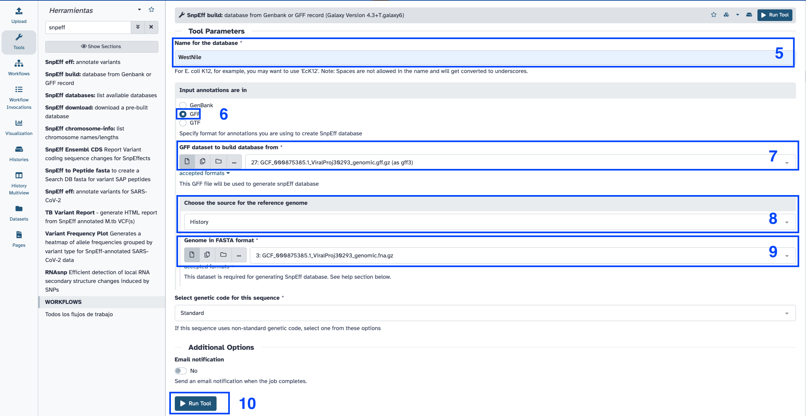
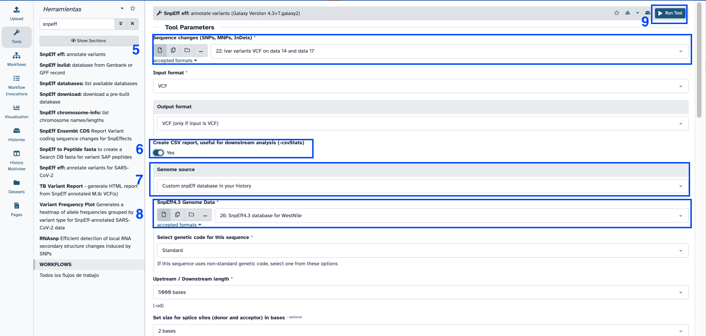

# Galaxy for virologist training Exercise 7: Illumina Variant Annotation 101

<div class="tables-start"></div>

|**Title**| Galaxy |
|---------|-------------------------------------------|
|**Training dataset:**|  PRJEB43037 - In August 2020, an outbreak of West Nile Virus affected 71 people with meningoencephalitis in Andalusia and 6 more cases in Extremadura (south-west of Spain), causing a total of eight deaths. The virus belonged to the lineage 1 and was relatively similar to previous outbreaks occurred in the Mediterranean region. Here, we present a detailed analysis of the outbreak, including an extensive phylogenetic study. This is one of the outbreak samples.
|**Questions:**| <ul><li>Which effects have variants in the genome?</li></ul>|
|**Objectives**:|<ul><li>Understand the importance of variants effect significance.</li></ul>|
|**Estimated time**:| 1h |

<div class="tables-end"></div>

## 1. Description

After performing variant calling, we want to know which is the importance of the variants in the viral genome. In order to give sense to the variants, we need to know in which gene they are, and which are their effects.

## 2. Upload data to galaxy

### Training dataset

- Experiment info: PRJEB43037, WGS, Illumina MiSeq, paired-end
- Fastq R1: [ERR5310322_1](https://ftp.sra.ebi.ac.uk/vol1/fastq/ERR531/002/ERR5310322/ERR5310322_1.fastq.gz) - url : `ftp://ftp.sra.ebi.ac.uk/vol1/fastq/ERR531/002/ERR5310322/ERR5310322_1.fastq.gz`
- Fastq R2: [ERR5310322_2](https://ftp.sra.ebi.ac.uk/vol1/fastq/ERR531/002/ERR5310322/ERR5310322_2.fastq.gz)  url : `ftp://ftp.sra.ebi.ac.uk/vol1/fastq/ERR531/002/ERR5310322/ERR5310322_2.fastq.gz`
- Reference genome NC_009942.1: [fasta](https://ftp.ncbi.nlm.nih.gov/genomes/all/GCF/000/875/385/GCF_000875385.1_ViralProj30293/GCF_000875385.1_ViralProj30293_genomic.fna.gz) -- [gff](https://ftp.ncbi.nlm.nih.gov/genomes/all/GCF/000/875/385/GCF_000875385.1_ViralProj30293/GCF_000875385.1_ViralProj30293_genomic.gff.gz)

### Create new history

- Click the `+` icon at the top of the history panel and create a new history with the name `mapping 101 tutorial` as explained [here](01_introduction_to_galaxy.md#2-galaxys-history)

### Upload data

Follow the same instructions [here](05_mapping.md#2-upload-data-to-galaxy)

```bash
ftp://ftp.sra.ebi.ac.uk/vol1/fastq/ERR531/002/ERR5310322/ERR5310322_1.fastq.gz
ftp://ftp.sra.ebi.ac.uk/vol1/fastq/ERR531/002/ERR5310322/ERR5310322_2.fastq.gz
https://ftp.ncbi.nlm.nih.gov/genomes/all/GCF/000/875/385/GCF_000875385.1_ViralProj30293/GCF_000875385.1_ViralProj30293_genomic.fna.gz
https://ftp.ncbi.nlm.nih.gov/genomes/all/GCF/000/875/385/GCF_000875385.1_ViralProj30293/GCF_000875385.1_ViralProj30293_genomic.gff.gz
```

## 3. Preprocess our reads

Follow instructions [here](02_quality.md#2-trimming)

## 4. Map our reads against our reference genome

Follow instructions [here](05_mapping.md#map-reads-using-bowtie2)

## 5. Variant Calling

Follow instructions [here](07_variant_calling_illumina.md#5-variant-calling)

## 6. Variants annotation

### Snpeff build

1. Search `snpeff build` in the search toolbox.
2. Select ` SnpEff build: database from Genbank or GFF record`
3. Select the version icon (three boxes)
4. Select the version `4.3+T.galaxy6`
5. Name of the database: WestNile.
6. Input annotations are in: GFF
7. GFF dataset to build database from: NC_009942.1 gff
8. Choose the source for the reference genome > History
9. Genome in FASTA format > NC_009942.1 fasta.
10. Click `Run tool`.

<p align="center"></p>
<p align="center"></p>

### Snpeff eff

1. Search `snpeff eff` in the search toolbox.
2. Select `SnpEff eff: annotate variants`
3. Select the version icon (three boxes)
4. Select the version `4.3+T.galaxy2`
5. Sequence changes (SNPs, MNPs, InDels): ivar vcf file
6. Create CSV report, useful for downstream analysis (-csvStats): Yes.
7. Genome source: Custom snpEff database in your history. 
8. SnpEff4.3 Genome Data > Snpeff build output.
9. Click `Run tool` and wait.

<p align="center"></p>
<p align="center"></p>

6. Click the :eye: icon in the SnpEff html output and check the results.

### SnpSift: transfrom vcf snpeff to table.

1. Search `SnpSift ExtractFields` in the search toolbox.
2. Variant input file in VCF format: snpeff eff vcf output.
3. Fields to extract: `CHROM POS ID REF ALT FILTER ANN[*].EFFECT ANN[*].GENE ANN[*].FEATURE ANN[*].HGVS_C ANN[*].HGVS_P`
4. One effect per line: Yes.
5. Click execute and wait.
6. Click the :eye: icon in the snpsift output and check the results.

<p align="center"></p>

> Galaxy history for this exercise: [https://usegalaxy.eu/u/smonzon/h/variant-calling-101-tutorial](https://usegalaxy.eu/u/smonzon/h/variant-calling-101-tutorial)
