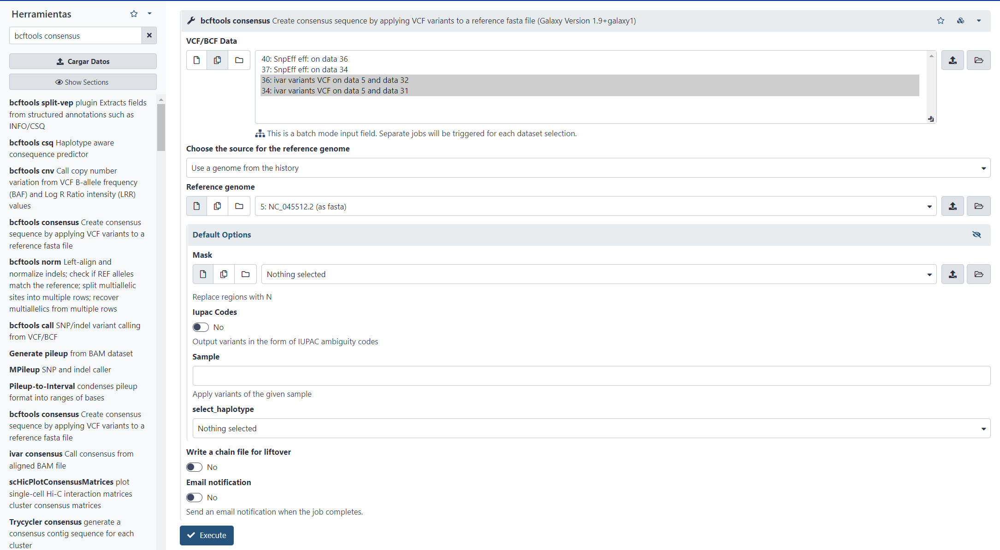
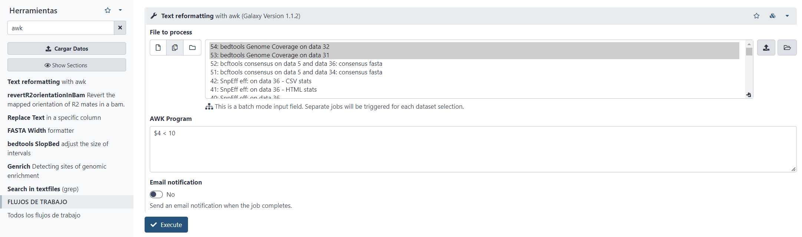

# Galaxy for virologist training Exercise 8: Viralrecon

<div class="tables-start"></div>

|**Title**| Galaxy |
|---------|-------------------------------------------|
|**Training dataset:**| SARS-CoV-2 downsampled sequencing data used to report variants and lineages to national Spanish epidemiologist.
|**Questions:**| <ul><li>How many variants does the samples have</li><li>Whoch lineage do the samples belong to?</li></ul>|
|**Objectives**:|<ul><li>Learn how to run viralrecon in Galaxy's interface</li><li>Understand the results generated</li></ul>|
|**Estimated time**:| 1h 15 min |

<div class="tables-end"></div>

In this report you will find all the information necessary to follow the steps to analyze SARS-CoV-2 data with Galaxy.

## Training overview
During this training we will following these steps:
1. [Register/Login](https://github.com/BU-ISCIII/galaxy_virologist_training/blob/one_week_4day_format/exercises/01_introduction_to_galaxy.md#sign-uplogin)
2. [Create a new history](#history) and name it **Viralrecon**
3. [Upload data](#data): Upload data for the analysis.
4. [Quality](#quality): Analysis of the quality of the raw reads.
5. [Trimming](#trimming): Quality trimming using fastp
6. [Mapping](#mapping): Mapping reads to reference genome with Bowtie2
7. [Stats](#stats): Mapping statistics with samtools and picard.
8. [Amplicons](#amplicons): Preprocessing steps mandatory for amplicon sequencing data.
9. [Variants](#variants): Variant calling and filtering.
10. [Consensus](#consensus): Consensus genome generation

**_From now on, each job we run in Galaxy will have a unique number for identifying each process. This numbers can differ depending on the number of samples and the times you run or delete any process. This training's snapshots were taken using other samples and some process were deleted for any reason, so numbers and names MAY DIFFER. However, the steps you have to run are THE SAME_**

## History

1. Create a new history in the ➕ and name it `Viralrecon`

## Data

We are going to upload files using these URLS [as seen in the Galaxy tutorial first day](https://github.com/BU-ISCIII/galaxy_virologist_training/blob/one_week_4day_format/exercises/01_introduction_to_galaxy.md#sign-uplogin)

```
https://zenodo.org/record/5724464/files/SARSCOV2-1_R1.fastq.gz?download=1
https://zenodo.org/record/5724464/files/SARSCOV2-1_R2.fastq.gz?download=1
https://zenodo.org/record/5724464/files/SARSCOV2-2_R1.fastq.gz?download=1
https://zenodo.org/record/5724464/files/SARSCOV2-2_R2.fastq.gz?download=1
````

Prior to any analysis, we have to download the fasta reference genome using the following URL:

```
https://zenodo.org/record/5724970/files/GCF_009858895.2_ASM985889v3_genomic.200409.fna.gz?download=1
```

Also, you will download the bed file of the amplicon primers, which contains the positions in the reference genome of each of the amplicon primers. Use this URL in the window:
```
https://zenodo.org/record/5724970/files/nCoV-2019.artic.V3.scheme.bed.txt?download=1
```

Finally, rename and tag the data as follows:

- `SARSCOV2-1_R1.fastq.gz`to `SARSCOV2-1_R1`with tagS `#sample1` and `#forward`
- `SARSCOV2-1_R2.fastq.gz`to `SARSCOV2-1_R2`with tagS `#sample1` and `#reverse`
- `SARSCOV2-2_R1.fastq.gz`to `SARSCOV2-2_R1`with tagS `#sample2` and `#forward`
- `SARSCOV2-2_R2.fastq.gz`to `SARSCOV2-2_R2`with tagS `#sample2` and `#reverse`
- `GCF_009858895.2_ASM985889v3_genomic.200409.fna.gz?download=1` to `NC_045512.2` with tag `#reference`
- `nCoV-2019.artic.V3.scheme.bed.txt?download=1` to `Amplicon bed` with tag `#amplicons`

<p align="center"></p>

## Quality

### Quality Analysis (FastQC)
Once we have the raw data, an important step is to analyze the quality of the reads, to know if the reads are worth it. To do this, we have to look for the program "_FastQC_" in the search bar, then select **FastQC Read Quality reports** and set the following parameters, same as [here](02_quality.md#1-quality-control):

    - Select multiple file data set and select the fastq files R1 and R2 for both samples
    - With *Ctrl* select the two datasets
    - Then go down and select **Execute**

<p align="center"></p>

### FastQC results visualization and interprepation questions
To visualize the information coming from FastQC we just have to select the job of interest. In this case we are interested in the "_Web page results_" so for the sample we want to see the results we have to click in the _eye_ to visualize galaxy results:

**_For more information about FastQC output visit [FasxstQC website](https://www.bioinformatics.babraham.ac.uk/projects/fastqc/Help/3%20Analysis%20Modules/)_**

**Question**
<details>
<summary>Which is the read length? What type of sequencing are we doing?</summary>
<br>
150 maximum. 2x150 sequencing (paired data of 150 read length)
</details>
<details>
<summary>How many reads has samlpe1 before trimming?</summary>
<br>
50000
</details>
<details>
<summary>How many reads has samlpe2 before trimming?</summary>
<br>
50000 (this is because we downsampled the data manually, usually samples from the same run do not have same number of reads)
</details>

## Trimming

### Quality trimming (Fastp)
Once we have check the quality of our reads, it's important to trim low quality nucleotides from those reads, for which we will use _Fastp_. So, in the search bar you look for fastp and then select "_fastp - fast all-in-one preprocessing for FASTQ files_". There, we will have to change some parameters ensure the trimming accuracy for this amplicon data. First of all we are going to do the analysis for the sample we gave to you (201569). These are the field we will have to change:

1. Search for **fastp** in the tools and select **fastp - fast all-in-one preprocessing for FASTQ files**
2. Select custom parameters:
    - Single-end or paired reads > Paired
        - Input 1 > Browse datasets (right folder icon) > Select both forward reads for both samples
        - Input 2 > Browse datasets > Select reverse reads for both samples
    - Display Filter Options
        - Quality Filtering options
            - Qualified Quality Phred = 30
            - Unqualified percent limit = 10
        - Length Filtering Options
            - Length required = 50
    - Read modification options
        - PoliX tail trimming > Enable polyX tail trimming
        - Per read cutting by quality options
            - Cut by quality in front (5') > Yes
            - Cut by quality in tail (3') > Yes
            - Cutting mean quality = 30
3. Finally, click on **Execute**


A message will appear, which means that 3 results will be generated:
  1. Two, one with the R1 trimmed reads, for each sample
  2. Another two, one with the R2 trimmed reads, for each sample
  3. Two, one with the HTML results, for each sample

**Repeat these steps for the second sample**

### Fastp results

Once fastp analysis is done, you can see the results by clicking in the eye ("_View Data_") in the fatp HTML results. 

Among the most relevant results, you have the:

- Summary: Stats summary
  - After filtering: Statistics of the reads after quality filtering
    - reads passed filters: Reads remaining after quality filter trimming
    - reads with low quality: Reads that were remove due to low quality
    - reads too short: Reads that didn't pass the minimum length filter.
  - After filtering: Plots after filtering
    - After filtering: read1: quality: Plot with the evolution of R1 quality over read position. Usually it decays in the last nucleotides.
    - After filtering: read2: quality: Same plot for R2.

**_For more information about FastQC output visit [Fastp github](https://github.com/OpenGene/fastp)_**

**Question**
<details>
<summary>How many reads are we keeping from sample1?</summary>
<br>
65.056 reads (65.06%)
</details>
<details>
<summary>How many reads did we lost for sample1 and why?</summary>
<br>
Low quality: 29.092 (29,09%) <br>
Too many Ns: 6 (0%)<br>
Too short: 5.846 (5.85%)<br> 
</details>
<details>
<summary>How many reads are we keeping from sample2?</summary>
<br>
63.318 (63.32%)
</details>
<details>
<summary>How many reads did we lost for sample2 and why?</summary>
<br>
Low quality: 31.526 (31.53%) <br>
Too many Ns: 4 (0%) <br>
Too short: 5.152 (5.15%) <br>
</details>

## Mapping

In order to call for variants between the samples and the reference, it's mandatory to map the sample reads to the reference genome. To do this we need the fasta file of the reference and the Bowtie2 index of that fasta file.

### Mapping reads with reference genome (Bowtie2)

Now we can start with the main mapping process. The first thing we have to do is look for the program "_Bowtie2_" in the search bar and then select "_Bowtie2 - map reads against reference genome_". Here we will have to set the following parameters, for the first sample, same as [here](03_mapping.md#map-reads-using-bowtie2)

3. Is this single or paired library > Paired-end
4. Fasta/Q file #1: **fastp Read 1 output** for both samples
5. Fasta/Q file #2: **fastp Read 2 output** for both samples
6. Will you select a reference genome from your history or use a built-in index? > Use a genome from the history and create index
  - **This is very important because we haven't previously created the SARS-Cov2 genome index, si bowtie 2 will generate it automatically.**
7. Select reference genome > GCF_009858895.2_ASM985889v3_genomic.200409.fna.gz
  - It's important to select the file we downloaded from URL.
8. Do you want to use presets? > Very sensitive local
9. Save the bowtie2 mapping statistics to the history > Yes
10. Execute


### Mapping results

Now we can see the mapping results for the samples. The bowtie2 resulting file is a .bam file, which is not easy to read by humans. This .bam file can be downloaded by clicking in the alignment file and then into download. Then, the resulting .gz file will contain the alignment .bam file that can be introduced in a software such as [IGV](http://software.broadinstitute.org/software/igv/) with the reference genome fasta file.

In our case, the file that can be visualize is the `mapping stats` file, which contains information such as the percentage of reads that aligned.

**Question**
<details>
<summary>Which is the overall alignment rate for sample1?</summary>
<br>
99.69%
</details>
<details>
<summary>And the overall alignment rate for sample2?</summary>
<br>
97.75%
</details>

## Stats

The previously shown files give few human readable information, because mapping files are supposed to be used by other programs. In this sense, we can use some programs to extract relevant statistical information about the mapping process.

### Samtools flagstat

The first program is Samtools, from which we will use the module samtools flagstat. To do this, we have to look in the search bar for "_samtools flagstat_" and then select "_Samtools flagstat tabulate descriptive stats for BAM datset_". There, we just have to select the samples we want to perform the mapping stats (in the example there are two samples, you just have to use one): _Bowtie2 on data X, data X and data X: alingment_. You can select the samples from the list in _Multiple datasets_ or select the folder icon (_Browse datasets_) to select the file from the history. Finally, select _Execute_


### Samtools results

The results of the samtools program gives information about the number and percentage of reads that mapped with the reference genome.

**Question**
<details>
<summary>How many reads mapped against the refernce genome for sample1?</summary>
<br>
64856
</details>
<details>
<summary> And how many for sample2?</summary>
<br>
61891
</details>

### Picard CollectWgsMetrics

Another program that gives statistical information about the mapping process is Picard. To run this program you just have to search "_Collect Wgs Metrics_" and then select "_CollectWgsMetrics compute metrics for evaluating of whole genome sequencing experiments_".

You have to change the following parameters:

1. Select SAM/BAM dataset or dataset collection > Dataset collection > Select both bam files at once
2. Load reference genome from > History
3. Select the fasta file we uploaded with the reference genome (NC_045512.2).
8. Treat bases with coverage exceeding this value as if they had coverage at this value = 1000000
9. Select validation stringency > Lenient
10. Execute.


This process will generate one output file per .bam alignment file selected as input.

### Picard results

Picard results consist in quite long files, so the best is to download those results and visualize them in your computer. Yo you have to click in the CollectWgsMetrics job you want to download, and then click in the save button:

Then you just have to open the file with Excell in your computer, and you will see a file with different columns with information about the percentage of the reference genome that is covered by the reads at a specific depth or the mean depth of coverage of the reference genome.

**Question**
<details>
<summary>Which is the mean coverage for sample1?</summary>
<br>
156.672207
</details>
<details>
<summary>Which percetage of the reference genome is covered to more than 10X by sample1 reads?</summary>
<br>
78.44%
</details>
<details>
<summary>Which is the mean coverage for sample2?</summary>
<br>
158.232619
</details>
<details>
<summary> Which percetage of the reference genome is covered to more than 10X by sample2 reads?</summary>
<br>
88.18%
</details>

## Amplicons

After mapping the reads to the reference genome, we are interested in removing the sequences of the amplicon primers. To do that you will use a program called iVar, and you will need a bed file with the positions of those amplicon primers.

### Trim amplicon sequences

Once you have the bed file, you just have to search for "_ivar trim_" in the search bar and select "_ivar trim Trim reads in aligned BAM_". Then follow these steps:

1. Bam file > Select the aligment bam file generated with Bowtie2 for both samples.
2. BED file with primer sequences and positions > Select the Amplicon bed file.
3. Include reads with no primers > Yes.
4. Minimum length of read to retain after trimming = 20


### iVar trim results

The resulting file from iVar will be a new BAM file where amplicon primer positions will be removed, so there's no result to visualize.

## Variants

Once we have the alingment statistics and files with amplicon primers trimmed, we can start with the variant calling process.

### iVar variants

[iVar](https://andersen-lab.github.io/ivar/html/manualpage.html) uses primer positions supplied in a BED file to soft clip primer sequences from an aligned and sorted BAM file. Following this, the reads are trimmed based on a quality threshold(Default: 20). To do the quality trimming, iVar uses a sliding window approach(Default: 4). The windows slides from the 5' end to the 3' end and if at any point the average base quality in the window falls below the threshold, the remaining read is soft clipped. If after trimming, the length of the read is greater than the minimum length specified(Default: 30), the read is written to the new trimmed BAM file.

1. Search for `ivar variants` and select `ivar variants Call variants from aligned BAM file`
2. Bam file > Select ivar trimmed bam files for both samples
3. Minimum frequency threshold > 0,75
4. Output format > Both tabular and VCF
5. In VCF only output variants that PASS all filters > Yes


### iVar results

iVar results consist in a VCF file containing all the variants found between the reference and the samples. Each line represents a variant the columns give information about that variant, such as the position in the reference genome, the reference allele, the alternate allele, if that variant passed the filters, and so on.

This variants have passed the minimum quality filter, which we set as 20, and the minimum allele frequency of 75%.

**Question**
<details>
<summary>How many possitions are diferent (variant) between reference and sample1 that pass all filters?</summary>
<br>
40
</details>
<details>
<summary>And how many between reference and sample2 that pass all filters?</summary>
<br>
40
</details>

### Annotation with SnpEff

Once we have the variants called, it's interesting to annotate those variants, for which you will use SnpEff. Search for "_snpeff_" in the searh bar and select "_SnpEff eff: annotate variants for SARS-CoV-2_", then change the following parameters:

3. Sequence changes (SNPs, MNPs, InDels) > Select ivar output VCF for both samples
4. Create CSV report, useful for downstream analysis (-csvStats) > Yes


### SnpEff results

The SnpEff gives three different results, from which the most interesting ones are:

1. Snpeff eff: Which is a VCF file with the annotation results. It is a very similar file to the ones we saw before for VarScan and Bcftools but with the last column different, containing relevant information about that variant.

2. Snpeff eff CSV stats: This file is a CSV file that contains statistics about the variant annotation process, such as the percentage of variants annotated, the percentage of variants that are MISSENSE or SILENT, the percentage that have HIGH, MODERATE or LOW effect, and so on.


**Question**
<details>
<summary>How many missense variants has sample1?</summary>
<br>
25
</details>
<details>
<summary>How many INDELs has sample1?</summary>
<br>
3
</details>
<details>
<summary>How many missense variants has sample2?</summary>
<br>
31
</details>
<details>
<summary>How many INDELs has sample2?</summary>
<br>
1
</details>

## Consensus
Once we have the most relevant variants that can be considered to include in the consensus genome, you can start with the consensus genome generation.

### Bcftools consensus

The final step consist in including the called variants into the reference genome, masking the regions with coverage lower than 10X, for which you will search for "_bcftools consensus_" in the search bar and then select "_bcftools consensus Create consensus sequence by applying VCF variants to a reference fasta file_". In this module you have to select:

1. VCF/BCF Data > VCF resulting from iVar variants.
2. Reference genome > Fasta file uploaded at the begining.
3. Mask: Select the text formatting outputs for both samples
4. Execute



This will generate a fasta file identical to the reference one, except for those nucleotides that are variants from the VCF file.

### Genome coverage calculation

At this point, we know that we have filtered the variants based on the coverage, selecting only those that had a coverage depth higher than 10X. So we cannot ensure that the consensus genome doesn't have any variant that we have filter in those regions with a coverage lower than 10X. So the next step is to determine which regions of the reference genome have a coverage lower than 10X.

To do that you will search for "_bedtools genomecov_" in the search bar and select "_bedtools Genome Coverage compute the coverage over an entire genome_", the you will have to select the following files:

1. Input type > BAM
2. BAM file > iVar output bam file
3. Output type > BedGraph coverage file
4. Report regions with zero coverage > Yes
5. Execute


This process will generate a BED file where each genomic position range of the reference genome has the coverage calculated. In this **example** you can see that for the positions of the reference genome from the nucleotide 55 to 63 they have a coverage of 20X.


### Regions filtering

From this resulting file from betdools genomecoverage you are going to select those regions with a coverage lower than 10X. Writing in the search bar "_awk_" and selecting "_Text reformatting with awk_", you are going to change:

3. File to process > Bedtools genome coverage file with the coverage regions for both samples
4. AWK Program = `$4 < 10`
  - **This will filter all the lines (genomic regions) that have a value lower than 10 in the 4th column (coverage)**
5. Execute



The resulting file is exactly the same as the one in Bedtools genomecoverage but only containing those lines with the genomic region coverage lower than 10X.

## Lineage
Now we are going to determine the lineage of the samples. We will use a software called pangolin. We are going to use the masked consensus genomes generated in the previous steps as follows:

1. Search for the **pangolin** tool
2. Select **Pangolin Phylogenetic Assignment of Outbreak Lineages** and set the following parameters:
3. Select the *bcftools consensus* generated in the previous step as input fasta file for both samples
4. **Execute**

<p align="center"></p>

Now we are going to have a look to the results from pangolin. As you can see, results are in table format, where you have in first place the reference genome and then de lineage assingned.

## All results

If you have any problem following this training and you want to visualize the resulting file you can access them through this URL:

https://usegalaxy.org/u/svarona/h/viralrecon2021

And viralrecon workflfow in:
https://usegalaxy.eu/u/svarona/w/viralrecon-emulator-imported-from-uploaded-file
